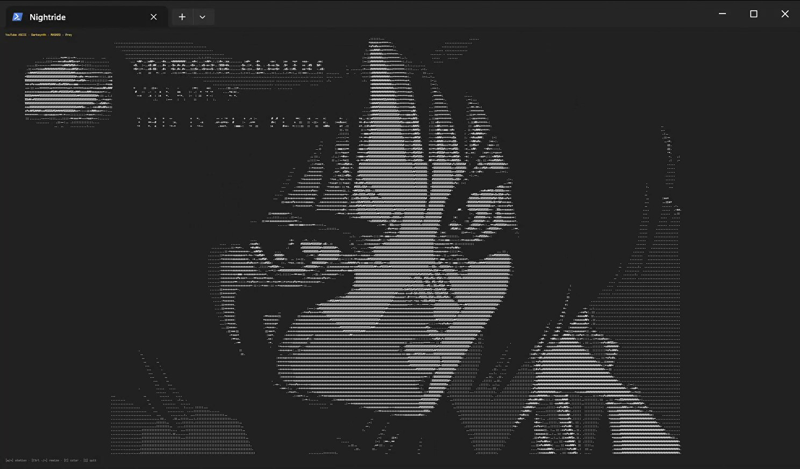
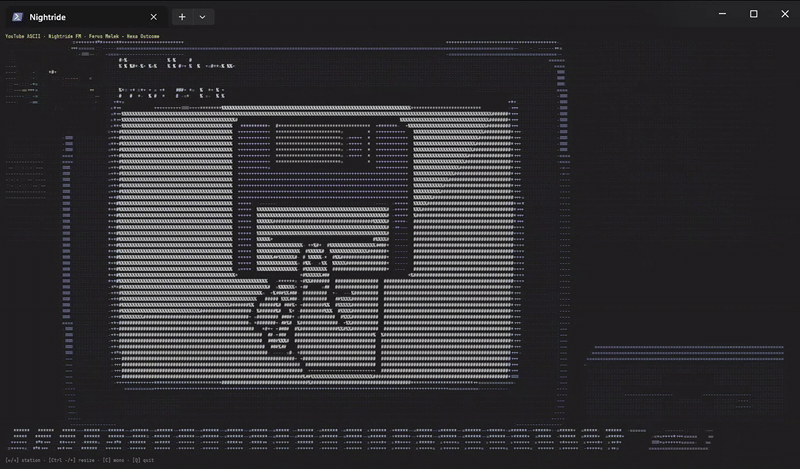
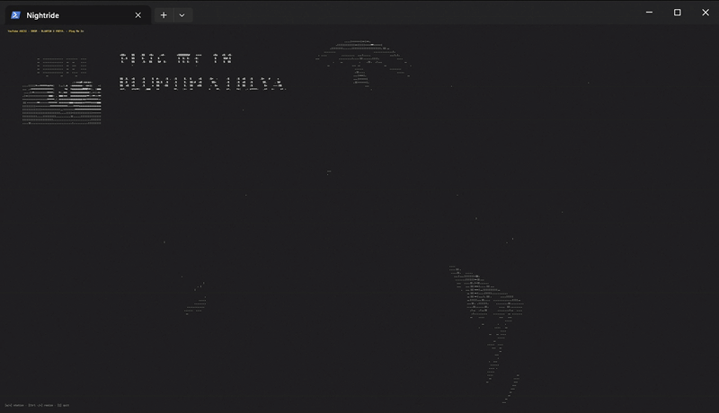
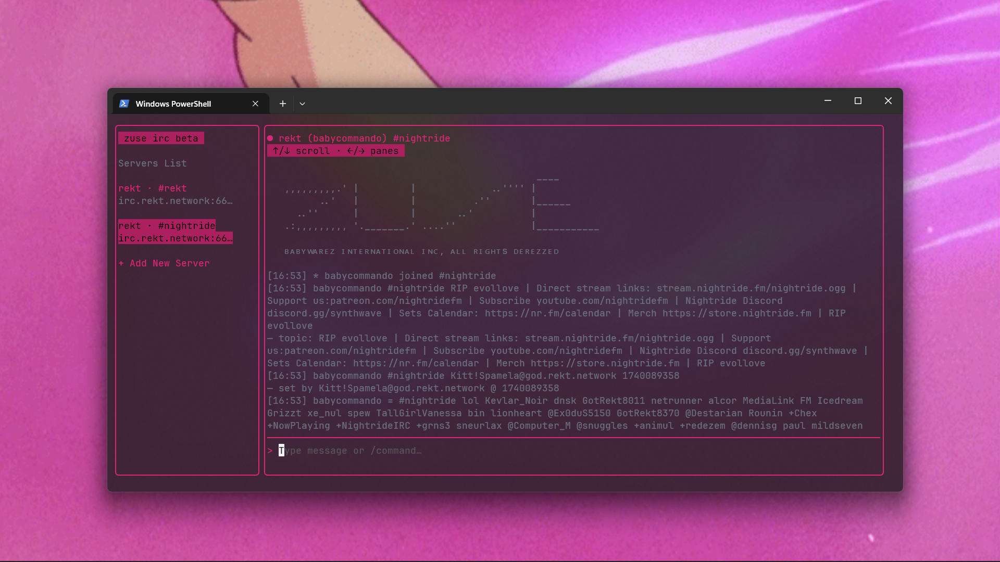
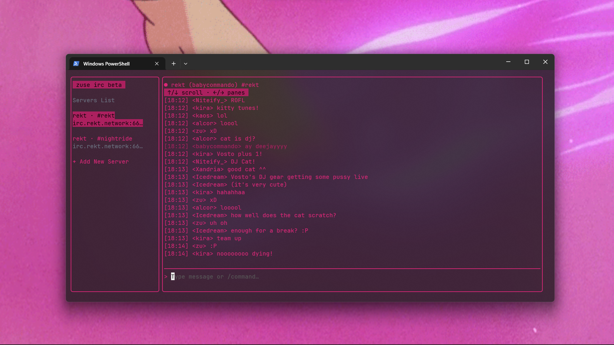
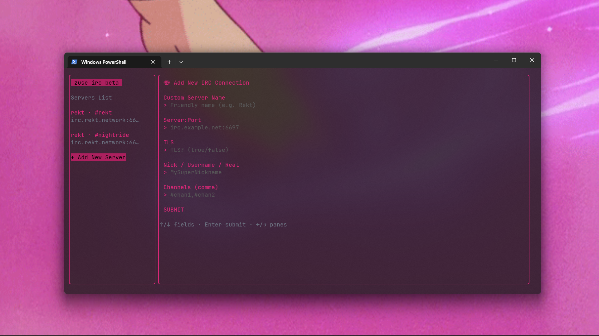
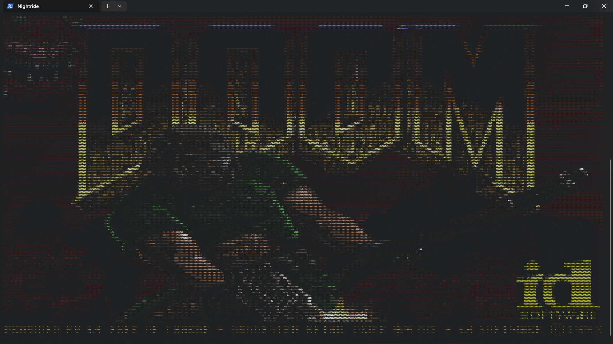

# nightride-cli

Nightride FM - the synthwaviest radio now inside your terminal, hackerman!!


This client establishes a direct uplink to Nightride FM via global packet infrastructure (internet). Audio is streamed, decoded locally and sent directly to your machine's audio output using low-level access through Go's sound libraries. Includes youtube to ascii for some neat visuals.

Built for the command line frontier.

#### Features:

- All radio stations directly accessible from the terminal
- Support for Discord Rich Presence

- Press Y to watch the youtube livestreams in ASCII, colored and monochromatic


<p align="center">
  
  
</p>

- Direct IRC access to Rekt Network via [ZUSE IRC](https://github.com/babycommando/zuse/tree/v1.0)

<!-- Top image -->


<!-- Two images side by side -->
<p align="center">
  
  
</p>

- Press D to run DOOM

The project includes a .wad freeware version of DOOM. Wad files are the things people use to run DOOM on toasters. WAD, according to the Doom Bible, is an acrostic for "Where's All the Data?". Read more on https://doom.fandom.com/wiki/WAD. Shout out to the [GORE engine](https://github.com/AndreRenaud/gore), which I fixed for Windows compatibility. If someone asks if it runs doom, you just answer "hell yeah". `Controls: Enter opens the game, arrows move, comma to shoot, space opens doors. Pressing D again quits doom.`


## Quick Installation

1. ### [Download](https://github.com/babycommando/nightride-cli/releases/tag/v1.0.1) a prebuilt binary from the releases or [build the Go project yourself](https://github.com/babycommando/nightride-cli/tree/main?tab=readme-ov-file#build-instructions-its-very-fast).

2. ### Dependencies

#### FFMPEG 
Required for watching the youtube livestreams in ascii.
Download it if you haven't already, and put it on your system path.

[https://www.ffmpeg.org/download.html](https://www.ffmpeg.org/download.html)

#### If you are on Linux, make sure you have ALSA (otherwise skip this step)

```bash
# Ubuntu/Debian
sudo apt install libasound2-dev
```

3. ### Add to PATH (so you can run "nightride" command from anywhere):

- **Windows**

```
 Move nightride.exe to a folder like C:\nightride, then:
 Press ⊞ Win → search "Environment Variables"
 Edit PATH, add: C:\nightride
```

- **Linux**

```bash
mkdir -p ~/.nightride && mv nightride ~/.nightride
chmod +x ~/.nightride/nightride
echo 'export PATH="$HOME/.nightride:$PATH"' >> ~/.bashrc && source ~/.bashrc
```

- **MacOS**

```bash
mkdir -p ~/.nightride && mv nightride ~/.nightride
chmod +x ~/.nightride/nightride
echo 'export PATH="$HOME/.nightride:$PATH"' >> ~/.zshrc && source ~/.zshrc
```

4. ### Open a fresh terminal and type `nightride` 😎

Important: for running DOOM make sure doom1.wad is on the same directory as your executable.

---

## Build Instructions (It's very fast)

1. ### Make sure you have [Go](https://go.dev/doc/install) installed.

2. ### Dependencies

#### FFMPEG 
Required for watching the youtube livestreams in ascii.
Download it if you haven't already, and put it on your system path.

[https://www.ffmpeg.org/download.html](https://www.ffmpeg.org/download.html)

#### If you are on Linux, make sure you have ALSA (otherwise skip this step)

```bash
# Ubuntu/Debian
sudo apt install libasound2-dev
# Arch
sudo pacman -S alsa-lib
# Fedora
sudo dnf install alsa-lib-devel
```

3. ### Install Go dependencies:

```bash
go mod tidy
```

4. ### Test it:

```bash
go run .
```

5. ### Build binary:

```bash
go build -o nightride # for mac/linux or
go build -o nightride.exe # for windows
```

6. ### Add to PATH so you can run nightride from anywhere

(instructions are the same for the quick installation)

7. ### Open a fresh terminal and type `nightride` 😎

---

## Updating Instructions

### New Dependencies
#### FFMPEG 
Required for watching the youtube livestreams in ascii.
Download it if you haven't already, and put it on your system path.

[https://www.ffmpeg.org/download.html](https://www.ffmpeg.org/download.html)

### Upgrading:
In your cloned repo do:

```bash
git pull # sync the updated repo
go mod tidy # install the dependencies

# Then build
go build -o nightride # for mac/linux or
go build -o nightride.exe # for windows
```

Then replace the built file where you had it in your path and make it executable:

- **Windows**

```
 Move nightride.exe to a folder like C:\nightride, then:
 Press ⊞ Win → search "Environment Variables"
 Edit PATH, add: C:\nightride
```

- **Linux**

```bash
mkdir -p ~/.nightride && mv nightride ~/.nightride
chmod +x ~/.nightride/nightride
echo 'export PATH="$HOME/.nightride:$PATH"' >> ~/.bashrc && source ~/.bashrc
```

- **MacOS**

```bash
mkdir -p ~/.nightride && mv nightride ~/.nightride
chmod +x ~/.nightride/nightride
echo 'export PATH="$HOME/.nightride:$PATH"' >> ~/.zshrc && source ~/.zshrc
```

Important: for running DOOM make sure doom1.wad is on the same directory as your executable.

---

## Contributing

1. Fork this repo

2. Create a new branch (feat/my-feature or fix/bug-xyz)

3. Submit a pull request

4. Play Home - Resonance in the meantime

---

```
 ..     %@@ .@@@@=   ..
 .  +@= -@@    -@@@#
  -@@@@@=@@ ..    #@@-
  @@= =@@@@ .....  =@@
 =@@    =@@  .      +@=
 #@* ..   =  +@@@@@@@@@
 =@@  ..   *#  =@@=
  @@+ .  -@.*@-  =@@@
  -@@   +@.   @*   #@=
      =@@@@.  @@@=
 .  -#@@##@@ =@#%@@-  .
  --===---=--==--===--
```
